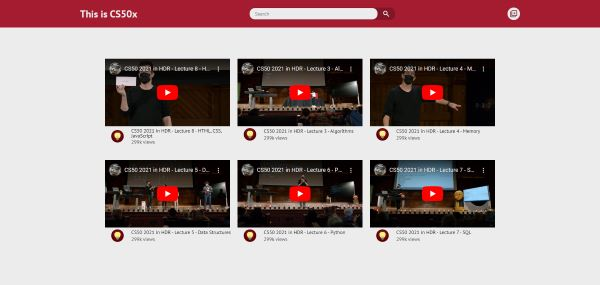

# CS50x Favorites
#### Video Demo:  https://youtu.be/GUs1irIWjVA
#### Description: A page that contains your favorite videos of CS50x lectures. Created with HTML, CSS, JS and json-server.

<a id="readme-top"></a>

<!-- PROJECT STATUS -->

> Project Status: ✅ (Concluded)

<br />

<!-- TABLE OF CONTENTS -->

<details>
  <summary>Table of Contents</summary>
  <ol>
    <li>
      <a href="#about-the-project">About The Project</a>
      <ul>
        <li><a href="#built-with">Built With</a></li>
        <li><a href="#functionalities">Functionalities</a></li>
      </ul>
    </li>
    <li>
      <a href="#getting-started">Getting Started</a>
      <ul>
        <li><a href="#prerequisites">Prerequisites</a></li>
        <li><a href="#installation">Installation</a></li>
      </ul>
    </li>
    <li><a href="#contributing">Contributing</a></li>
    <li><a href="#contact">Contact</a></li>
  </ol>
</details>

<br />

<!-- ABOUT THE PROJECT -->

## **About The Project**

<div align="center">



</div>

<!-- BUILT WITH -->

### **Built With**

This page was built using HTML, CSS, JS and json-server for mocking back-end up.

<!-- FUNCTIONALITIES -->

### **Functionalities**

* View videos.
* Search videos.
* Add video.

<p align="right">[ <a href="#readme-top">back to top</a> ]</p>

<br />

<!-- GETTING STARTED -->

## **Getting Started**

To get a local copy and running follow these simple example steps.

### **Prerequisites**

Using git clone you must have **git** on your computer. Otherwise, you can also download these files on repository. I recommend open the project using **vscode** and **live server extension**.

### **Installation**

1. Clone the repo

```
git clone https://github.com/Preedroos/cs50x-favorites.git
```

2. Enter the folder

```
cd cs50x-favorites
```

3. Turn on the json-server

```
json-server db.json --watch
```

4. Open the project on vscode and use live server extension.

<p align="right">[ <a href="#readme-top">back to top</a> ]</p>

<br />

<!-- CONTRIBUTING -->

## **Contributing**

Contributions are what make the open source community such an amazing place to learn, inspire, and create. Any contributions you make are **greatly appreciated**.

If you have a suggestion that would make this better, please fork the repo and create a pull request. You can also simply open an issue with the tag "enhancement".
Don't forget to give the project a star! Thanks again!

1. Fork the Project
2. Create your Feature Branch (`git checkout -b feature/AmazingFeature`)
3. Commit your Changes (`git commit -m 'Add some AmazingFeature'`)
4. Push to the Branch (`git push origin feature/AmazingFeature`)
5. Open a Pull Request

<p align="right">[ <a href="#readme-top">back to top</a> ]</p>

<br />

<!-- CONTACT -->

## **Contact**

Pedro Paulo Fagundes Cabral

- [GitHub](https://github.com/Preedroos)

- [LinkedIn](https://www.linkedin.com/in/pedropfcabral/)

- [Twitter](https://twitter.com/preedroos)

Email: preedroos@gmail.com

Project Link: [CS50x Favorites](https://github.com/Preedros/cs50x-favorites)

<p align="right">[ <a href="#readme-top">back to top</a> ]</p>
